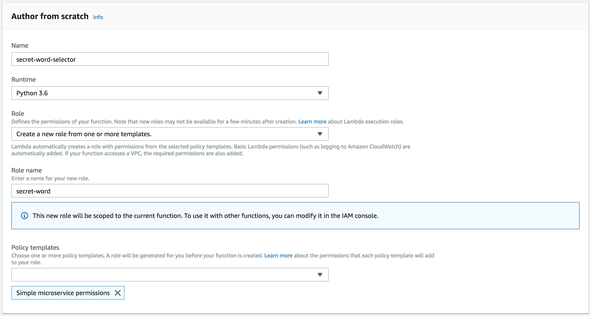

# Creating Slack bots 

Goal: a slack integration that will do two things:

1. post a "word of the day" at a set time in the morning
2. listen for that word throughout the day, and if it's heard, reply with a GIF of Pee Wee Herman yelling a la "Pee Wee's Playhouse."

# 1: Post "word of the day"

## Part 1: Set up the incoming webhook

Each day a scheduled job will run, ping an API at Wordnik to retrieve the word, and post a message to Slack via incoming webhook.

For reference I'm following the guide here: [https://api.slack.com/incoming-webhooks](https://api.slack.com/incoming-webhooks)

Step 1: Create a new Slack App (big green button at the link above)

Step 2: Enable incoming webhooks (a simple slider on the app control panel above)

Step 3: Create a new incoming webhook URL 

For this, I created a #bot-testing channel and linked the URL to that. I can move this later on once testing is complete.

Step 4: Test the URL 

The tutorial has a simple curl example you can use here to push a test message over your webhook URL into the channel chosen in Step 3.

"Hello, World!" just appeared in the testing channel, so I'm on the right track. Now I need to write a script that will retrieve the word of the day and post it into that room. Python is a good choice for a language here since it's very good at text manipulation, and is supported in AWS Lambda (where I intend to deploy this script.) Where the above steps all involved basic button clicking, now comes actual code. Sigh. 

## Part 2: Script and schedule the word-of-the-day message

Step 1: Write the Python script

The script is relatively straightforward, though I did spend a little time setting up my laptop to have a proper Python environment installed. My plan is to create a script that runs locally, then work on deploying it to AWS.

Virtual environments are your friends - this will help in migrating to AWS later. (The libraries we reference - requests, json, configparser - will need to be uploaded with the script to AWS, as AWS doesn't have a library installer or other management service for this. To make your life easier, `venv` will create a local `site-packages` folder containing the requisite libraries.) 

Here's how to set up your virtual environment: 

    python3 -m venv venv # do this one time in your repo
    source venv/bin/activate # do this every time you work on your code
    deactivate # when you're done

Helpful libraries to have in your Python project:

- configparser: lets you have an external config file of the necessary keys, API fields, etc that you'll need to manage.
- json: helps in loading strings into dictionaries, and making dictionaries into JSON text snippets. Particularly useful in communicating with Slack, which expects a JSON payload to the POST method that makes a message.
- requests: very straightforward API for making HTTP calls. (Realistically this could have been enough to integrate with the Wordnik API, but they have a client, so why not try that?)
- boto3: allows Python to interact with other AWS services. In our case, we'll use this to write the word of the day to S3.

This repo contains wordbot.py, which currently shows the basic flow of the program. While it works in the best case right now, it will require a lot more error handling to be truly robust (for example, to post to Slack if an API is not responding.) 

The script (as currently written) can be executed on the command line as `python wordbot.py`  

If all goes to plan the output should look like:

    ['wordnik', 'slack']
    bleb
    A blister or pustule.
    A bubble, as in water or other fluid, or in a substance that has been fluid, as glass.
    ok

Step 2: Deploy to AWS

In AWS, I'm setting up a new Lambda function as follows:

In addition to the simple microservice permissions that come by default, I've also added AmazonS3FullAccess, to allow the script to read and write files in S3. To be more secure we could create custom permissions limiting this to just file reads and writes, but that can be done later on.

As configured, the script will write a file called `wod.json` to the bucket wordbot.study-hall.club. The contents will be a single JSON entry like `{"word": "innatism"}`. I added these values directly to the sample config file as well, since they're not privileged, and the bucket is not accessible to the public.

In setting up the lambda function to run, the first step will be to create the distribution package. On the command line I ran the following commands, which created the zip file in the format AWS expects:

- `cd venv/lib/python3.7/site-packages/`
- `zip -r9 ~/Code/wordbot/package.zip .`
- `cd ~/Code/wordbot`
- `zip -g package.zip wordbot.py wordbot.conf`

The zip file can then be uploaded into the Lambda UI.

Step 3: Setting up the trigger to run daily

To set a simple daily schedule for every morning at 7 AM, I used the `cron` function in in the CloudWatch Events trigger set with the following rule: 

    cron(0 11 * * ? *)

This will trigger the function to run each day at 11 AM UTC (7 AM Eastern Daylight Time, 6 AM Eastern Standard Time).

## Part 3: Monitor Slack and respond to the "word of the day"

For this I referenced a [different blog post](https://chatbotslife.com/write-a-serverless-slack-chat-bot-using-aws-e2d2432c380e) about building chat bots. Following the instructions here made the process rather straightforward, so rather than duplicate that information here, I'll note some bumps that I ran into along the way for future reference:
1. The execution role I set up for the first script, above, was allowed to write log entries to the log group secret-word-selector, not secret-word-responder. To fix this I added the CloudWatchLogsFullAccess policy to the execution role.
2. Adding message.channels to the Event Subscriptions tab for the app in Slack doesn't do anything if the app doesn't also have the correct OAuth scope. I needed to add message.channels there as well, which led to the bot being re-installed.
3. Even though the app is installed as an "integration" in #bot-testing, this only allowed it to post using webhooks. This isn't what's used for interactive conversations; bot users are. It therefore needed to (a) post to a different URL / API endpoint to respond in the right places, and (b) needed to be invited as a user into the #bot-testing channel. Keep this one in mind later when we decide to move this to a more public place, since it'll need to be moved for both the Webhook Integration and the Bot User. 
4. Slack recently changed how they handle Authorizations; previously you could pass the bot token in the payload of the POST request; now, you have to add it to the Authorization HTTP Header.

Documentation reviewed in the process of building this app:

- Wordnik API source code: [https://github.com/wordnik/wordnik-python3/](https://github.com/wordnik/wordnik-python3/)
- Wordnik API documentation: [https://developer.wordnik.com/docs](https://developer.wordnik.com/docs)
